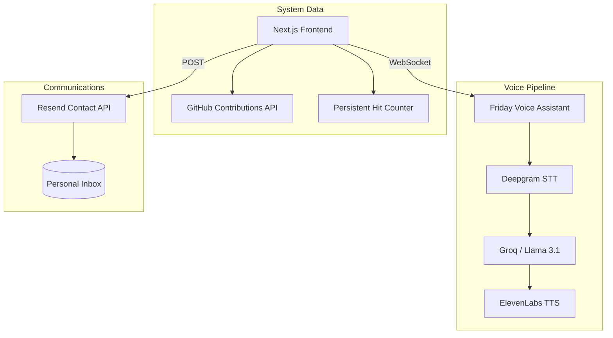

<div align="center">
  
  <p><strong>Professional Portfolio of Tanish Rajput</strong></p>
  <p>An interactive technical asset engineered to showcase production-grade LLM systems, low-latency voice orchestration, and complex agentic workflows.</p>
  <p>
    <a href="https://nextjs.org/" target="_blank" rel="noreferrer">
      
    </a>
    <a href="https://vapi.ai/" target="_blank" rel="noreferrer">
      
    </a>
    <a href="https://langchain.com/" target="_blank" rel="noreferrer">
      
    </a>
    <a href="https://www.typescriptlang.org/" target="_blank" rel="noreferrer">
      
    </a>
    <a href="https://framer.com/motion" target="_blank" rel="noreferrer">
      
    </a>
    <a href="https://tailwindcss.com/" target="_blank" rel="noreferrer">
      
    </a>
  </p>
</div>

---

## Core Capabilities
This portfolio is engineered to move beyond static documentation, serving as a live environment for **latency optimization, observability, and systems architecture**:

*   **(Friday)[https://www.github.com/tanishra/friday] Voice Persona:** A real-time AI assistant built using LiveKit, deepgram and openai. Features sub-second response times, bilingual support (EN/HI), and an autonomous task-execution roadmap.
*   **Temporal Engineering Log:** A redesigned experience architecture utilizing a vertical "Stack DNA" rail and sticky markers to visualize technology evolution over time.
*   **Cinema Hero Gallery:** Full-visibility project deep-dives with brand-accurate technical tagging and vertical-stacked modal layouts.
*   **Activity Heatmap:** Live data-driven activity tracking via GitHub API, styled with a signature terracotta palette and a persistent zero-setup hit counter.
*   **Performance-First Design:** GPU-accelerated rendering and hardware-optimized CSS to ensure zero-stutter interactions and high-frame-rate animations.
*   **Secure Communication:** Production-ready contact API powered by Resend, featuring professional notification templates for direct recruitment inquiries.

---

## Architecture
The system utilizes a "Stateless UI / Stateful Intelligence" architecture to minimize client-side overhead while maximizing AI response speed.



---

## Tech Stack
*   **Frontend:** Next.js 14 (App Router), React 18, Tailwind CSS, Framer Motion.
*   **AI/Intelligence:** Vapi (Orchestration), Deepgram (STT), ElevenLabs (TTS), Groq/OpenAI (LLMs).
*   **Infrastructure:** Resend (SMTP), Vercel (CD/CI), Dwyl Hits (Analytics).
*   **Design Tokens:** Fraunces (Display), Inter (Sans), JetBrains Mono (Technical).

---

## Quick Start

### 1. Installation
```bash
# Clone the repository
git clone https://github.com/tanishra/portfolio.git
cd portfolio

# Install dependencies
npm install
```

### 2. Environment Configuration
Create a `.env` file in the root directory:
```env
# Voice Agent
NEXT_PUBLIC_VAPI_PUBLIC_KEY=your_vapi_key
NEXT_PUBLIC_VAPI_ASSISTANT_ID=your_assistant_id

# Contact System
RESEND_API_KEY=re_your_resend_key
CONTACT_EMAIL=your_email@example.com
```

### 3. Execution
```bash
npm run dev
```

---

<div align="center">
  <p>Designed and Developed by <b>Tanish Rajput</b></p>
  <a href="https://linkedin.com/in/tr26">LinkedIn</a> • <a href="https://github.com/tanishra">GitHub</a>
</div>
